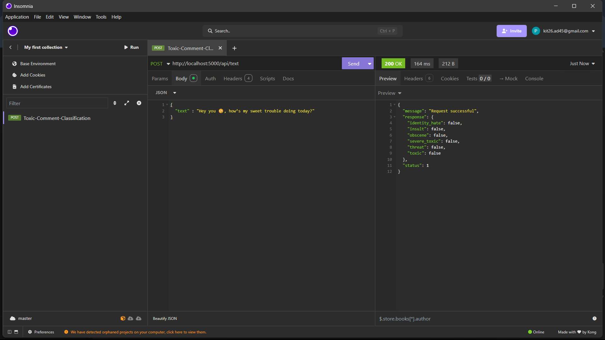
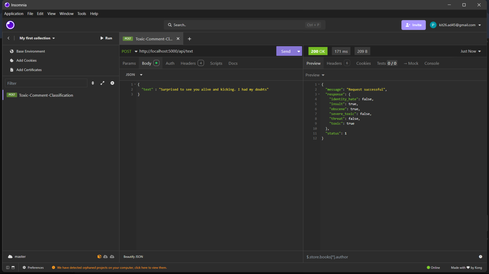

# 🚫 Toxic Comment Classification using BERT

This project classifies toxic as well as sarcastic comments using a fine-tuned BERT model with an accuracy of over **95%**. It integrates unlabeled data from the [Jigsaw Toxic Comment Classification Challenge](https://www.kaggle.com/competitions/jigsaw-unintended-bias-in-toxicity-classification) and utilizes a custom API wrapper named `isomina` for training orchestration and evaluation.

---

## 🧠 Model

- Base: `bert-base-uncased`
- Fine-tuned on labeled and pseudo-labeled Jigsaw dataset
- Multi-label classification (`toxic`, `severe_toxic`, `obscene`, `threat`, `insult`, `identity_hate`)
- Trained using custom `isomina` API wrapper for streamlined experimentation and deployment

---

## 📊 Output Examples

| Visualization of Predictions | 
  
  

- In output2.png, we see that a sarcastic message was correctly identified.

---

## 🚀 Features

- >95% validation accuracy
- Semi-supervised training using pseudo-labeling
- BERT fine-tuning pipeline
- Easy experimentation with `isomina` API
- Robust evaluation with ROC AUC, F1, and accuracy metrics

---

- **Data**:
  - Labeled: From [Jigsaw Toxic Comment Classification Challenge](https://www.kaggle.com/c/jigsaw-toxic-comment-classification-challenge)
  - Unlabeled: From [Jigsaw Unintended Bias Dataset](https://www.kaggle.com/c/jigsaw-unintended-bias-in-toxicity-classification)
- **API**: Integrated with the custom `isomina` API for:
  - Data preprocessing
  - Model orchestration
  - Metrics visualization
  - Inference handling

---

## 🔧 Installation & Setup

### 1. Clone the Repository

```bash
git clone https://github.com/yourusername/toxic-comment-bert.git
cd toxic-comment-bert
```
## Requirements
- transformers
- pandas
- numpy
- scikit-learn
- matplotlib
- seaborn
- tqdm
- isomina  # Custom or private package, ensure it's accessible
- torch>=1.10.0
